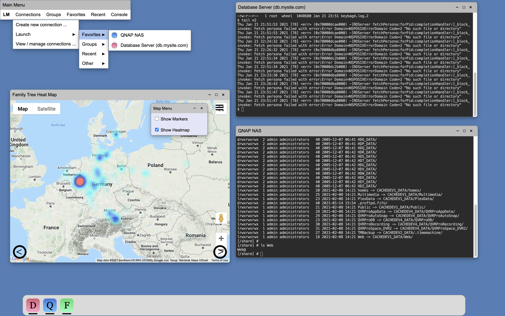
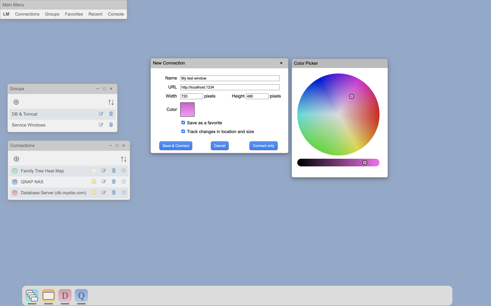

# LM
Launch Manager is a standalone js/html/css app designed to launch webistes inside of your browser designed to emulate a desktop environment. Sure you can just launch windows directy from your favorite browser, but with Launch Manager you can launch mulitple sites simultaneoulsy and since LM is able to track window position and size you come back to the same dimensional state you left it at even if the browser is restarted. You can move windows around, resize them, minimize, maximize, and more. 

Launch Manager was originally geared towards remote access through a browser without the need for tabs. It can of course launch any site that allows it to be shown in an iframe. Please note that many sites such a any of the Google sites, Apple, Mircosoft, and more, do not allow themselves to be shown in an iframe for security reasons.

The true purpose of LM was actually to give TMK_desktop.js (included herein) a real life work out with it's menus, modals, launchpad, and windows.

## Usage
Launch the file ``lm.html`` (found in LM directory) in a browser.

## Screenshots

